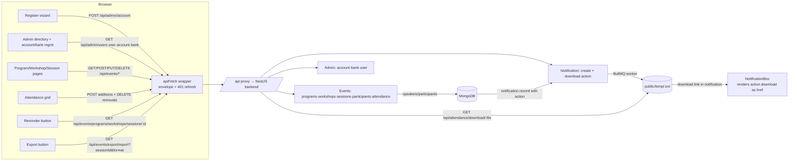

# Phase 6: Admin Bank/Accounts & Events Depth - Research

**Researched:** 2026-08-29
**Domain:** Admin employee onboarding + account/bank management; events hierarchy (program→workshop→session) CRUD + participant rosters + attendance grid + reminders + async export delivery
**Confidence:** HIGH

## Summary

The backend contract for every Phase 6 route was verified directly against `../saher-backend/src/**/*.routes.ts`, controllers, schemas, and the permission matrix (`role-permission.ts`). All admin routes mount at `/api/admin` (protected), all event routes at `/api/events` (protected). The atomic-onboarding endpoint `POST /api/admin/account` exists and is a server-side MongoDB transaction over user + bank + account; the frontend's existing 4-step register wizard already posts to it — Phase 6 needs to reconcile it to the verified contract, not rebuild it. The events module is **largely pre-built** (services, hooks, pages under `program/` exist) but carries contract drift: `addParticipantsInProgram` sends the wrong body shape, no restore/reminder/export functions exist, and the roster/attendance UI reads the raw-ObjectId program-participants endpoint where it needs the populated program detail — marking the pre-existing roster/mark-all surfaces effectively broken today.

The two most load-bearing discoveries: **(1) attendance semantics are merge-only** — both `POST` and `PUT /api/events/attendance/sessions/:id` `$addToSet` (never replace), while `DELETE` is all-or-nothing (404 if any id isn't currently marked) — so the "fast checkbox grid with update/delete corrections" must compute a diff between the session's existing `participants` array and the new selection, then issue POST for additions and DELETE for removals. **(2) bank writes are manager-only** — admin has only `bank:read`; no role holds `delete,bank`, so `DELETE /api/admin/bank/:id` 403s for every role; requirement ADMN-04's "delete bank details" is unsatisfiable against the current backend (open question for the planner). The reminder endpoint is confirmed as the odd `GET /api/events/programs/workshops/sessions/:sessionId`; the export endpoint is confirmed as `GET /api/events/export/report?sessionId=&format=pdf|xlsx`, which enqueues a BullMQ job and delivers the download link via a notification action (`{type:'download', url:'/api/attendance/download/<jobId>.<ext>'}`) — the notification feed box already renders download action buttons.

**Primary recommendation:** Plan Phase 6 as **reconcile-and-complete**: (1) add `services/admin.api.ts` (account GET/PUT, bank CRUD+restore, user restore) with zod schemas mirroring the verified backend; (2) fix the register wizard's `employeeType` enum (missing `free`/`intern`) and route the registration through a proper hook; (3) fix event services to the verified contract (participantIds body, restore endpoints, reminder, export, populating roster from `GET /programs/:id`); (4) build the admin directory + account/bank management UI on top of the existing users table; (5) build the attendance grid as a diff engine; (6) wire reminder + export-to-notification delivery. No new npm packages are required — everything needed (react-hook-form, zod, TanStack Query/Table, shadcn checkbox/table/dialog, lucide, date-fns) is already installed.

<phase_requirements>
## Phase Requirements

| ID | Description | Research Support |
|----|-------------|------------------|
| ADMN-01 | Admin onboards employee atomically (account + bank) | `POST /api/admin/account` verified — server-side txn over user+account+bank, password auto-generated (name[0..4].upper + DOB year), welcome email after txn. Existing 4-step register wizard already posts `{user, account, bank}` — fix enum drift (`employeeType` missing `free`/`intern`) and wire through hook. |
| ADMN-02 | Search + paginate employee directory | `GET /api/admin/users` (authorize read user) returns **unpaginated full array** (Redis-cached 7d) — search/pagination must be client-side; existing users table already has name filter + pagination + sorting. |
| ADMN-03 | View/edit account details per employee | View exists at `app/(main)/(manager)/users/[id]/page.tsx` via `GET /api/admin/user/:id` (returns account+bank+user populated). Edit is net-new: `PUT /api/admin/account/:id` accepts only `accountBaseSchema.partial().strict()` — sending `user`/`bank` fields 400s. |
| ADMN-04 | CRUD bank details, masked in lists | `POST/PUT/PATCH(restore) /api/admin/bank*` verified — all gated `bank:write/update` = **manager only**. `DELETE /api/admin/bank/:id` requires `delete,bank` — **no role has it (always 403)**. Account GET endpoints embed full unmasked `bank` — masking rule applies to any list rendering. |
| ADMN-05 | Soft-delete and restore users | `DELETE /api/admin/user/:id` (self-delete blocked, 404 on already-deleted) + `PATCH /api/admin/user/:id/restore` verified; existing `features/users/user-action.tsx` already implements both with isActive badge; restore guarded by `update,user` (admin+manager). |
| EVNT-01 | Drill-down programs → workshops → sessions | All three list endpoints support `keyword` (regex title/description + program/workshop title **and ObjectId**) — per-program workshops via `?keyword=<programId>`, per-workshop sessions likewise. Existing `program/` pages exist but global-filtered; add clear drill-down nav/filters. |
| EVNT-02 | CRUD programs incl. trash/restore | `POST/PUT/DELETE/PATCH(restore) /api/events/programs` verified; delete = `delete,event` (**admin only**), create/edit/restore = admin+manager. `getPrograms` paginated `?keyword&page&limit&isDeleted`. |
| EVNT-03 | CRUD workshops within a program | `POST /api/events/workshops/:programId` (requires existing program) + PUT/DELETE/restore verified; list searchable by program title/id. |
| EVNT-04 | CRUD sessions (IST datetime pickers) | `POST /api/events/sessions/:programId` verified — `date`/`startTime` must be **future**, `endTime > startTime`, `workshop` optional (**auto-creates a workshop** if omitted!), `speaker` ≥1 ObjectId (uses user-search picker). Sends notifications+push to speakers on create/update. |
| EVNT-05 | Participant rosters attach/detach | **Contract resolved: participants are FREE-ENTRY records** (`POST /api/events/participants` — free-text name, phone, age, etc.), NOT employees. Attach: `POST /api/events/programs/participants/:programId` body `{participantIds[]}` ($addToSet); detach: `DELETE .../:participantId` ($pull). **Quirk:** `GET /programs/participants/:programId` returns raw ObjectId strings; populate roster from `GET /programs/:id` instead. |
| EVNT-06 | Fast attendance checkbox grid + update/delete corrections | `POST/PUT /api/events/attendance/sessions/:id` body `{participantIds[]}` — **both are $addToSet merge**; `DELETE ...` removes listed ids (all-or-nothing 404 if any not currently marked). Grid must diff session.participants vs selection → POST additions, DELETE removals. Existing grid page posts whole selection but never prefills — broken/empty re-marks today. |
| EVNT-07 | One-click session reminder | Verified: `GET /api/events/programs/workshops/sessions/:sessionId` (odd GET, authorize `read,event`) → sends success notification to session speaker, 201, data null. Missing in frontend services — add it. |
| EVNT-08 | Export; download link via notification | Verified: `GET /api/events/export/report?sessionId=<ObjectId>&format=pdf|xlsx` → enqueues BullMQ job, returns `{jobId, format}`; worker posts notification `{type:'download', label:'Report', url:'/api/attendance/download/<jobId>.<ext>', method:'GET'}`; file served by `GET /api/attendance/download/:fileName`. Notification box already renders `<a href>` download buttons. Frontend needs service fn + "check notifications" UX. |

**Contract check items from ROADMAP — all resolved:**
1. ✅ Bank/accounts + event routes + `authorize()` guards verified (full matrix below)
2. ✅ Participant-creation input mode = **free entry** (name is free text; only session `speaker` references users)
3. ✅ Reminder endpoint = `GET /api/events/programs/workshops/sessions/:sessionId`
4. ✅ Export route = `GET /api/events/export/report?sessionId&format`
</phase_requirements>

## Project Constraints (from AGENTS.md)

Directives extracted from `AGENTS.md` (frontend + global `~/.config/opencode/AGENTS.md`) that the plan must honor:

- **Stack is locked:** Next.js 16.1.6 App Router + Tailwind v4 + shadcn/ui (radix-nova) — no new UI framework; extend existing patterns.
- **Ponytail skill mandatory** for all coding: reuse existing helpers (normalizeList, PaginationFooter, TrashTabPattern, resource-list-factory, apiFetch, lib/date.ts, can()) before writing new code; shortest working diff; no speculative abstraction.
- **Conventions:** kebab-case files; services in `services/*.api.ts` with zod schemas (`z.infer` types); queries/mutations in `hooks/use-*.ts` (never inline); `@/*` imports only; `Export const` arrow functions for hooks/services; comments minimal; no `console.log` (lint error).
- **Data fetching rules:** `apiFetch()` only (single HTTP funnel, envelope `{success,message,data,meta?}`, 401 single-flight refresh); client-side rendering only; no server data fetching.
- **State:** TanStack Query only — mutations invalidate by queryKey; no optimistic writes for money/bank mutations (D-29); double-submit prevention on money/bank actions (D-26).
- **Dates:** all date display/parsing through `lib/date.ts` IST utilities (+05:30); never raw browser-timezone manipulation.
- **Verification gates:** `pnpm lint`, `pnpm typecheck`, `pnpm test` (vitest) must stay green; `pnpm build` for full check. Writes must be routed through a GSD workflow — do not edit repo files outside `/gsd-*` flows.
- **Backend is canonical:** out of scope to change saher-backend; resolve payload mismatches in the frontend (flag, don't patch backend).

## Architectural Responsibility Map

| Capability | Primary Tier | Secondary Tier | Rationale |
|------------|-------------|----------------|-----------|
| Atomic employee onboarding (account+bank) | API / Backend | Browser / Client | Backend owns the MongoDB transaction + password gen + email; browser only submits one validated `{user,account,bank}` envelope |
| Account/bank read & edit | API / Backend | Database / Storage | Endpoints own Redis cache invalidation on writes; browser must not cache KYC reads beyond TanStack staleTime |
| Employee directory search/pagination | Browser / Client | API / Backend | Backend `GET /admin/users` is a full unpaginated array — filtering/sorting/paging is client-side TanStack Table |
| Soft-delete/restore users | API / Backend | Browser / Client | Backend owns `isActive/deletedAt/deletedBy`; browser calls DELETE/PATCH mutations and invalidates `["user","list"]` |
| Event hierarchy CRUD + trash/restore | API / Backend | Browser / Client | Backend owns soft-delete flags and paginated keyword search; browser provides drill-down navigation + TrashTabPattern tabs |
| Participant rosters (attach/detach) | API / Backend | Browser / Client | Backend owns `$addToSet`/`$pull` on `program.participants`; browser renders populated roster from `GET /programs/:id` |
| Session attendance correction | API / Backend | Browser / Client | Backend defines merge-on-write semantics; the diff computation (added vs removed) is browser logic feeding POST + DELETE |
| Session reminder | API / Backend | Browser / Client | Backend sends the notification; browser fires the odd GET and reflects success |
| Export request + download delivery | API / Backend (job) | Frontend Server (proxy) | Backend enqueues BullMQ, writes file to `public/temp`, sends notification action; download is a plain `GET /api/attendance/download/:file` (same-origin via reverse proxy) |

## Standard Stack

No new npm packages are needed for this phase. All libraries required are already installed and pinned in `package.json` — the phase reuses the proven slice-contract stack.

### Core (already installed — reuse, do not reinstall)
| Library | Version | Purpose | Why Standard |
|---------|---------|---------|--------------|
| @tanstack/react-query | ^5.94.5 | All server state; mutations invalidate queryKeys | Single source of server state across app (`app/provider.tsx`) |
| @tanstack/react-table | ^8.21.3 | Directory/roster tables with client-side search/sort/pagination | Existing users + corrections tables pattern |
| react-hook-form + @hookform/resolvers + zod | ^7.71.1 / ^5.2.2 / ^4.3.6 | Onboarding wizard, account/bank edit forms, response schemas | Every form in the app |
| lib/date.ts (date-fns ^4.1.0) | — | IST display/parse for session date/time pickers | D-18: single home for dates |
| apiFetch + normalizeList + resource-list-factory | — | HTTP funnel + list normalization + hook factory | Phase 2-5 shared infra — always route through these |
| PaginationFooter + TrashTabPattern | — | shared/ components | Promotion contract from Phase 3 |
| can() + RoleGuard/RoleAccess | — | RBAC affordance gating + route guards | D-13 mirror of backend role-permission.ts |
| shadcn/ui (checkbox, table, dialog, dropdown, tabs, field, input, date picker via react-day-picker) | — | UI primitives | radix-nova style; never hand-roll new primitives |

### Supporting
| Library | Version | Purpose | When to Use |
|---------|---------|---------|-------------|
| lucide-react | ^0.575.0 | Icons for action menus | All row actions |
| sonner | — | Toasts for mutation feedback | Standard error/success surfacing |
| components/image-upload (react-dropzone + react-image-crop) | installed | Document/image upload for onboarding + participant images | Onboarding already uses it (4 uploads: image/aadhar/pan/resume) |
| tiptap editor | ^3.26.0 | Rich description bodies (program/workshop/session descriptions are HTML-sanitized server-side) | Existing session/program editors already use it |

### Alternatives Considered
| Instead of | Could Use | Tradeoff |
|------------|-----------|----------|
| Client-side directory pagination | Backend pagination for `/admin/users` | Backend has no pagination on the users list — client-side is the only option without backend changes |
| diff-engine attendance grid | Sending full selection to PUT | **PUT is $addToSet merge, not replace** — a full selection silently ORs into history instead of correcting it; diff+POST/DELETE is the only correct correction path |
| Notification action for export delivery | Polling a status endpoint | Backend has no status endpoint other than the export cache key; notification action is the designed delivery mechanism |

**Installation:** none — `pnpm install` unchanged. Do not add packages without a checkpoint.

**Version verification:** all versions above read from the committed `package.json` (installed + locked in `pnpm-lock.yaml`). No new registry verification needed — nothing new is introduced.

## Package Legitimacy Audit

No external packages are recommended for this phase. The entire feature set is implementable with already-installed dependencies. Accordingly:

- **Packages removed due to slopcheck [SLOP] verdict:** none
- **Packages flagged as suspicious [SUS]:** none
- *If any future plan in this phase proposes a new dependency, it must (a) not exist as an alternative in the installed set, (b) pass `slopcheck install <pkg> --json` with a repo URL, and (c) be gated behind `checkpoint:human-verify` before install.*

## Architecture Patterns

### System Architecture Diagram



Key flows traceable in the diagram:
1. **Onboarding:** Wizard → POST /api/admin/account → server txn (user+bank+account) → welcome email; directory invalidates `["user","list"]`.
2. **Attendance correction:** Grid shows session.participants (from GET /programs/:id roster ∩ session detail); toggles compute diff → POST (added) / DELETE (removed) `/api/events/attendance/sessions/:id`.
3. **Export:** one click → GET /events/export/report → jobId → worker writes file + notification(action=download) → NotificationBox renders `<a href="/api/attendance/download/<jobId>.pdf">` → browser downloads via reverse-proxied same-origin path.

### Recommended Project Structure (deltas to the existing tree)
```
services/
├── admin.api.ts            # NEW: account GET/PUT, bank CRUD+restore, user get/update, admin/users list — all zod-typed
├── program.api.ts          # FIX: addParticipantsInProgram body → {participantIds}; add restoreProgram; roster from getSingleProgram
├── workshop.api.ts         # ADD: restoreWorkshop (PATCH /workshops/restore/:id)
├── session.api.ts          # ADD: restoreSession, sendSessionReminder, requestSessionExport; fix attendance response types
├── participant.api.ts      # ADD: restoreParticipant; isDeleted param support
hooks/
├── use-admin.ts            # NEW: admin directory + account/bank hooks (invalidation-only, D-29)
└── use-sessions.ts         # ADD: reminder/export mutations; attendance diff helpers
features/
├── admin/                  # NEW (or extend users/): directory with account/bank drawers
│   ├── bank-details.tsx    # bank create/edit form + masking util
│   └── account-edit.tsx    # account edit form (accountBaseSchema.partial().strict())
└── program/session/        # attendance grid rework: prefill + diff + corrections
```

### Pattern 1: Slice-contract data layer (services + factory hooks)
**What:** Every endpoint gets a typed service fn (zod schema → `z.infer` type) next to `apiFetch`; list resources route through `createResourceListHook`; mutations invalidate `["<resource>"]` keys.
**When to use:** All Phase 6 domain work — matches noticeboard/reimbursement/payroll precedent.
**Example:** the service module skeleton mirrors `services/notice.api.ts` / `services/payroll.api.ts` (verified in repo). New `services/admin.api.ts` follows the same pattern: one fn per endpoint, `envelope` handled by apiFetch, `normalizeList` for the users array (wrap the array into `{items,page:1,limit:all,totalPages:1}` — the endpoint is unpaginated).

### Pattern 2: Attendance checkbox-grid diff engine
**What:** The grid's initial state must be `session.data.participants` (already-marked ids), not empty. On submit, compute `added = selection − existing` and `removed = existing − selection`; run `POST /attendance/sessions/:id {participantIds: added}` when added.length, and `DELETE /attendance/sessions/:id {participantIds: removed}` when removed.length (sequential mutations, both invalidating `["sessions"]`). "Mark All"/"Clear" buttons restate `selection`; submit stays disabled while pending (D-26).
**When to use:** EVNT-06 only — this is the only place the merge semantics matter.

### Pattern 3: Async export → notification delivery
**What:** Trigger export with `GET /api/events/export/report?sessionId=<id>&format=pdf`; show a confirming toast ("Report generation started — check notifications for the download link"); surface the notification feed's action button (already renders). Do not attempt to read the file directly — the response only carries `jobId`. A secondary call while the job runs returns "request is processing" — treat as success and keep the toast.
**When to use:** EVNT-08; also matches the attendance-export precedent from Phase 5.

### Anti-Patterns to Avoid
- **Sending the whole selection to PUT expecting replace semantics:** backend `$addToSet` merges — corrections become impossible without the diff engine (Pattern 2).
- **Populating roster UI from `GET /programs/participants/:programId`:** returns raw ObjectId strings; the existing program detail and attendance pages already trip on this. Roster UI reads the populated array from `GET /programs/:id` (`.participants[]`).
- **Building admin account/bank UI without role gating:** bank forms must gate on `can(role,'write','bank')` (manager) while account edit gates on `can(role,'update','account')` (admin+manager); admin users must not see bank write affordances they cannot use.
- **Sending PUT /api/admin/account/:id with the `{user, account, bank}` envelope:** the update endpoint is `accountBaseSchema.partial().strict()` — extra keys 400.
- **Dates in session forms:** backend rejects past `date`/`startTime` and requires `endTime > startTime`; prefill from IST-converted values and always send ISO strings.

## Don't Hand-Roll

| Problem | Don't Build | Use Instead | Why |
|---------|-------------|-------------|-----|
| PDF/XLSX report generation | Any frontend report generator | Backend export endpoint + notification download link | Backend already runs BullMQ + worker writing to `public/temp`; a frontend report lib duplicates it |
| Atomic user+bank+account creation | Two sequential calls (user, then bank) | Single `POST /api/admin/account` | Backend transaction rolls back on failure; separate calls can half-fail |
| Pagination/search/sort for tables | Custom table logic | TanStack Table + existing `data-table.tsx` + PaginationFooter | Duplicates the users/corrections pattern |
| Token refresh / envelope / session death | re-implement requests | `apiFetch` + lib/session.ts | Global single-flight refresh is load-bearing (D-19) |
| RBAC affordance logic | ad-hoc role checks | `can()` + RoleGuard/RoleAccess | D-13 mirror keeps UI and backend enforcement aligned |
| Date conversion/formatting | ad-hoc Date/Intl | lib/date.ts IST utilities | D-18 unified IST behavior |
| Account-number masking | — | One tiny util (see Code Examples) | Masking is a 3-line string function — not worth a lib; the rule is *apply it in lists only* |

**Key insight:** the backend does the heavy lifting (transactions, soft-deletes, Redis invalidation, notifications, file generation) — the frontend's job is faithful envelope handling and correct affordance gating. Every "missing" backend behavior (bank delete, replace-attendance) should be treated as a **frontend limitation to design around**, never a backend patch.

## Common Pitfalls

### Pitfall 1: Attendance corrections merge instead of replace
**What goes wrong:** Re-marking a session's grid without diffing re-adds everyone and never removes anyone who was unchecked; "corrections" silently fail.
**Why it happens:** Both POST and PUT `/api/events/attendance/sessions/:id` call `$addToSet` (verified in `session-attendance.controller.ts` and `session-update-attendance.controller.ts`); there is no replace/set endpoint.
**How to avoid:** Grid prefills from `session.participants`; submit diffs (added→POST, removed→DELETE). Only fall back to plain POST for a "mark all" first-time save with an empty existing set.
**Warning signs:** attendance page shows more marked users than boxes checked; "Mark All" on an already-marked session duplicates notifications.

### Pitfall 2: Bank writes 403 for admins (and delete 403s for everyone)
**What goes wrong:** Admin users click create/edit/delete bank → "You do not have permission to write this bank."
**Why it happens:** `ROLE_PERMISSIONS[admin]` has only `bank:read`; `delete,bank` is granted to **no role** (`role-permission.ts` — verified); DELETE route still exists but is unreachable.
**How to avoid:** Gate bank forms/actions with `can(role,'write'|'update','bank')` (manager). Do not render a bank delete control at all (it can never succeed) — see Open Question #1 for the ADMN-04 implication.
**Warning signs:** 403 toast in the console when a manager/admin opens bank dialog.

### Pitfall 3: Raw-ObjectId participant lists masquerading as objects
**What goes wrong:** Roster sections render empty/broken cards (name undefined) — already observable in `app/(main)/program/[id]/page.tsx` and the attendance grid.
**Why it happens:** `GET /api/events/programs/participants/:programId` returns `program.participants` **without populate** (program-participant.controller.ts:14-18), while `GET /api/events/programs/:id` populates them; the frontend's `getParticipantFromProgram` types the raw ids as `ParticipantT[]`.
**How to avoid:** Use `getSingleProgram(id).participants` for any roster rendering; reserve the id-list endpoint for attach/detach bookkeeping. Fix `services/program.api.ts` typing accordingly.
**Warning signs:** `participant.id` undefined → cards with empty names; `key={undefined}` console warnings.

### Pitfall 4: Onboarding enum drift
**What goes wrong:** Backend `employeeTypeList = ['free','intern','full-time','part-time','volunteer']`; the register wizard and `AccountT` type only offer `['full-time','part-time','volunteer']` — onboarding can never create free/intern employees, and the rendered profile type lies.
**Why it happens:** Frontend predates the backend enum change.
**How to avoid:** Update `register-schema.ts` enum + `use-profile.ts AccountT.employeeType` to the full five-value list; keep the `part-time ⇒ employeeShift required` refine (matches backend).

### Pitfall 5: Participants list includes deleted rows by default
**What goes wrong:** The roster picker shows ghost participants.
**Why it happens:** `getParticipants` applies `isDeleted` only when the query param is present (`participant.controller.ts:110-112`); programs/workshops/sessions default to `false`, but participants have **no default filter**.
**How to avoid:** Always send `isDeleted=false` explicitly on participant list calls. Sessions/workshops can rely on defaults but pass it anyway for symmetry.

### Pitfall 6: Export-download link is not a status check
**What goes wrong:** Expecting the export response to contain a download URL.
**Why it happens:** `GET /api/events/export/report` returns `{jobId, format}` immediately; the download URL arrives later inside a notification's `action.url` (`/api/attendance/download/<jobId>.<ext>` — note the `/api/attendance/` prefix even though the trigger was `/api/events/`).
**How to avoid:** After triggering, toast "check notifications"; rely on the existing NotificationBox download button. If the job is re-requested, the backend returns "request is processing" or "report already generated" — treat as success, don't re-enqueue.
**Warning signs:** user waits on the session page for a file that never arrives.

### Pitfall 7: Session create auto-creates a workshop
**What goes wrong:** Omitting `workshop` in the create body silently creates a workshop named after the session — duplicate/empty workshop rows appear under the program.
**Why it happens:** `addSession` creates a Workshop when `workshopId` is absent (session.controller.ts:54-62).
**How to avoid:**  For EVNT-04, either always pass an explicit workshop (drill-down requires it anyway) or surface the shallow-workshop behavior consciously — writing tests that pin the chosen behavior.
**Warning signs:** workshops list contains titles identical to session titles.

### Pitfall 8: Update endpoints that ignore soft-delete state
**What goes wrong:** Editing a trashed program/workshop/session silently succeeds.
**Why it happens:** `editWorkshop` and `editParticipant` use bare `findByIdAndUpdate` (no `isDeleted:false` filter); programs/sessions do filter. Not a blocker — just don't assume restore-then-edit flows are enforced server-side; keep trash tabs read-only for edits until restored.
**Warning signs:** PUT succeeds on a deleted row.

### Pitfall 9: Session date/time must be future
**What goes wrong:** Saving an old-day session (e.g. editing last month's records) → 400 "Date must be present or future".
**Why it happens:** `createSessionSchema`/`updatedSessionSchema` refine `date` and `startTime` against `new Date()`.
**How to avoid:** Document in the UI that sessions are future-dated; prefill edit forms with the session's ISO datetimes converted via lib/date.ts; surface the 400 message inline.
**Warning signs:** edit-save failing only for past sessions.

### Pitfall 10: `isDeleted` filter shape differs across event lists
**What goes wrong:** Programs use the sloppy `(req.query.isDeleted as boolean) || false` (string `"false"` is truthy — rescued only by Mongoose's boolean cast), workshops/sessions compare `=== 'true'`, participants treat absence as "no filter".
**How to avoid:** Send explicit `isDeleted=false|true` on every list call; never omit it for participants.

## Code Examples

Verified patterns — the exact backend contract shapes and the frontend wiring to produce.

### Service additions for `services/admin.api.ts` (mirror backend schema exactly)
```typescript
// POST /api/admin/account — registration envelope (verified: admin/account/schema.ts)
export const registerAccount = async (data: RegisterFormData) => {
  const res = await apiFetch<{ id: string }>("/api/admin/account", {
    method: "POST",
    body: JSON.stringify({ user: data.user, account: data.account, bank: data.bank }),
  });
  return res; // data = the new user _id; apiFetch throws on failure
};

// PUT /api/admin/account/:id — account fields ONLY (schema is .partial().strict())
export const updateAccount = async ({ id, data }: { id: string; data: Partial<AccountFields> }) => {
  return apiFetch(`/api/admin/account/${id}`, { method: "PUT", body: JSON.stringify(data) });
};

// Bank: POST /api/admin/bank (manager-only write); PUT/PATCH-restore same path pattern
export const getBank = async (id: string) =>
  (await apiFetch<BankT>(`/api/admin/bank/${id}`, { method: "GET" })).data;
```
**Key contract:** bank create/update/restore are `manager`-gated (`bank:write`/`bank:update`); account update is `admin`+`manager` (`account:update`); account create is `admin`+`manager` (`account:write`); user restore is `admin`+`manager` (`user:update`).

### Account-number masking util (list contexts only)
```typescript
// Verified need: full accountNumber arrives unmasked on every account/bank read.
export const maskAccount = (num: string): string =>
  num.length > 4 ? `•••• ${num.slice(-4)}` : "••••";
```

### Attendance grid prefill + diff (EVNT-06 — the central new logic)
```typescript
// session.participants = ParticipantT[] present on GET /api/events/sessions/:id
const existing = useMemo(() => new Set(session.data?.participants?.map(p => p.id) ?? []), [session.data]);
const added = selection.filter(id => !existing.has(id));
const removed = [...existing].filter(id => !selection.includes(id));

const onSubmit = async () => {
  if (added.length) await markAttendance.mutateAsync({ id, data: { participantIds: added } });
  if (removed.length) await deleteAttendance.mutateAsync({ id, data: { participantIds: removed } });
  queryClient.invalidateQueries({ queryKey: ["sessions"] }); // D-29: invalidation only
};
```
Both mutations exist in `use-sessions.ts` already; the grid must additionally prefill `present` from `existing` instead of `[]`.

### Reminder + export (EVNT-07/08)
```typescript
// Verified: GET /api/events/programs/workshops/sessions/:sessionId (odd GET — no body)
export const sendSessionReminder = async (sessionId: string) =>
  apiFetch(`/api/events/programs/workshops/sessions/${sessionId}`, { method: "GET" });

// Verified: GET /api/events/export/report?sessionId=&format=pdf|xlsx  → { jobId, format }
export const requestSessionExport = async (sessionId: string, format: "pdf" | "xlsx" = "pdf") =>
  (await apiFetch<{ jobId: string; format: string }>(
    `/api/events/export/report?sessionId=${sessionId}&format=${format}`, { method: "GET" })).data;
// UI: toast.success("Report generation started — check notifications"); NotificationBox
// already renders action.type === "download" as <a href={action.url}> (notification-box.tsx:109-113).
// Download URL arrives as "/api/attendance/download/<jobId>.<ext>" (note /api/attendance prefix).
```

### Program-participants attach body (fixes existing bug)
```typescript
// Current bug in program.api.ts: sends JSON.stringify(participants) — backend expects { participantIds }
export const addParticipantsInProgram = async ({ id, participants }: { id: string; participants: string[] }) =>
  apiFetch(`/api/events/programs/participants/${id}`, {
    method: "POST",
    body: JSON.stringify({ participantIds: participants }), // verified addParticipantsToProgramSchema
  });
```

### Restore endpoints (all verified — pattern identical across resources)
```typescript
// PATCH /api/events/programs/restore/:id · /workshops/restore/:id · /sessions/restore/:id · /participants/restore/:id
export const restoreProgram = (id: string) => apiFetch(`/api/events/programs/restore/${id}`, { method: "PATCH" });
export const restoreSession = (id: string) => apiFetch(`/api/events/sessions/restore/${id}`, { method: "PATCH" });
// admin: PATCH /api/admin/user/:id/restore, PATCH /api/admin/bank/restore/:id (manager-only update)
```

## State of the Art

| Old Approach | Current Approach | When Changed | Impact |
|--------------|------------------|--------------|--------|
| Register wizard posts raw fetches + inline `if (!res.success)` checks | Hook-based service with apiFetch throwing on failure | Phase 1-5 infra | Dead success-checks can be dropped; new admin.api.ts follows the new pattern |
| `GET /admin/users` assumed paginated | Verified unpaginated (full array, 7-day Redis cache) | This research | Directory is client-side paginated/filtered; invalidate `["user","list"]` after onboarding |
| Events services hand-rolled (wrong participantIds body, missing restores/reminder/export) | Verified-contract services + factory hooks | This research | Fix program.api.ts; add missing fns |
| Attendance grid empty-prefill merge-submit | Diff-engine correction grid (additions POST, removals DELETE) | This research | Only way to satisfy "update/delete corrections" |
| Bank/account admin surface absent | New `services/admin.api.ts` + account/bank UI under manager/admin gating | This research | ADMN-03/04 complete |

**Deprecated/outdated:**
- `features/register/register-schema.ts` **employeeType enum** (missing `free`/`intern`) — must be reconciled or backend rejects valid hires, and `use-profile.ts AccountT.employeeType` type likewise.
- `services/program.api.ts` `addParticipantsInProgram` body shape — broken against the verified schema.
- Program/workshop/session/participant services missing restore/reminder/export wrappers — those endpoints exist and are unused.

## Assumptions Log

| # | Claim | Section | Risk if Wrong |
|---|-------|---------|---------------|
| A1 | No CONTEXT.md existed for phase 6 at research time (`.planning/phases/06-*/06-CONTEXT.md` absent) — no locked discuss-phase decisions to honor | Summary | Low — planner freedom; re-check at plan time |
| A2 | `DELETE /api/admin/bank/:id` is unreachable (no role holds `delete,bank`) and ADMN-04 "delete bank details" must be descoped/flagged to the user | Pitfalls/Open Questions | If backend permission matrix changes mid-phase, delete becomes available — checkpoint before hiding the control |
| A3 | Export delivery is notification-only; the frontend should not poll | Pattern 3 | Confirmed by controller (queue-cache responses) — LOW residual risk that a status endpoint appears |
| A4 | The intended EVNT-06 "fast checkbox grid" is the existing session-attendance page reworked, not a new route | Code Examples | Route structure already exists (`/program/sessions/attendance/[id]`) |
| A5 | Register wizard already satisfies ADMN-01's "one guided form creating account + bank details atomically" modulo enum drift | Standard Stack | If the wizard is judged out of spec during review, the plan rebuilds it on the same endpoint |
| A6 | Session speakers must be selected via the user-search picker (users, not participants) | Phase requirements | Verified by `speaker: z.array(objectId()).min(1)` against Users — user-search picker from Phase 4/5 is the intended control |
| A7 | Manager can view employee account/bank details despite lacking `account:read` (route has no authorize middleware; controller allows admin+manager) | Pitfalls/ADR | UI gating on `can('read','account')` alone would wrongly hide from managers — gate directory pages by group role, not the account read permission |

## Open Questions (RESOLVED)

1. **How should ADMN-04 "delete bank details" be fulfilled?** — RESOLVED: user ruled restore-only. 06-02 ships create/view/update/restore + masking, no delete control; the ruling is recorded in 06-02.
   - What we know: backend `DELETE /api/admin/bank/:id` requires `delete,bank`; **no role in `role-permission.ts` has it** — every caller gets 403. Restore requires `update,bank` (manager only). Backend is out of scope to change.
   - What's unclear: product intent — hide delete entirely, offer it with a graceful 403 surface, or treat "delete" as satisfied by soft-delete semantics that the backend cannot currently express for banks.
   - Recommendation: Do NOT build a bank delete control. Build create/view/update/restore (manager) and read (admin) as the contract allows, and surface the ADMN-04 gap in the plan's acceptance note for the user to rule on.

2. **Session roster + attendance prefill today's live data** — RESOLVED: 06-06 unit-tests the pure `computeAttendanceDiff` regardless of seeded data + human checkpoint for live verification; prefill from `sessions/:id` populated participants.
   - What we know: `GET /api/events/sessions/:id` returns `participants` populated; `GET /api/events/programs/:id` returns program roster populated; the program-participants ID-list endpoint is the wrong source (Pitfall 3).
   - What's unclear: whether already-marked attendance records exist in the dev DB to test the diff path (empty sessions would only exercise the addition path).
   - Recommendation: seed/verify by marking a session manually before the correction tests; the diff engine must be unit-tested regardless (pure function, no msw needed).

3. **Role gating for the admin directory + account/bank pages** — RESOLVED: extend the existing `users` directory with account/bank detail + edit drawer; keep register as-is; gate bank forms via `can('write','bank')`; no new route groups (matches checker D7c/plans 06-01/02).
   - What we know: directory = `read,user` (admin+manager); account read allowed for admin+manager by controller; bank writes manager-only; user writes admin+manager.
   - What's unclear: whether the phase should create a distinct bank/accounts admin page or fold into existing `/(manager)/users` and `/(admin)/register` route groups.
   - Recommendation: extend the existing `users` directory (add account/bank detail + edit drawer), keep register as-is, gate bank forms via `can('write','bank')`; no new route groups needed.

## Environment Availability

| Dependency | Required By | Available | Version | Fallback |
|------------|------------|-----------|---------|----------|
| Node.js | runtime/build/tests | ✓ | v24.19.0 (matches Docker `node:24-alpine`) | — |
| pnpm | install/lockfile | ✓ | 11.22.0 | corepack |
| Saher backend repo | contract verification (done) + live manual checks | ✓ | `../saher-backend` present | OpenAPI at `/docs` |
| vitest + msw | test harness | ✓ | vitest ^4.1.11 (tests/setup.ts + test-server.ts) | — |
| Next.js dev/build | dev verification | ✓ | 16.1.6 | — |
| Running backend + MongoDB + Redis | manual/end-to-end verification of export notification flow | ? | not probed this session | verify at execution start (STATE.md flags payload checks per phase) |

**Missing dependencies with no fallback:** none for code/config work. A live backend (with BullMQ worker + Redis) is required only for manual E2E of EVNT-07/08 — flag a checkpoint if the environment is down.

## Security Domain

### Applicable ASVS Categories

| ASVS Category | Applies | Standard Control |
|---------------|---------|-----------------|
| V2 Authentication | no — unchanged | existing cookie session + apiFetch 401 refresh |
| V3 Session Management | no | — |
| V4 Access Control | **yes** | `authorize()` server-side + mirrored `can()` gating; bank-admin distinction is the phase's sharp edge |
| V5 Input Validation | **yes** | zod schemas mirroring backend (IFSC regex, phone +91 strip, age<18 parentDetails refine, strict account update) — validated twice (client + backend) |
| V6 Cryptography | no | password hashing is backend-side |

### Known Threat Patterns for this stack

| Pattern | STRIDE | Standard Mitigation |
|---------|--------|---------------------|
| IDOR on account/bank/user reads by id | Information Disclosure | Backend controller role checks for non-`me` reads; frontend never passes ids derived from URL params beyond the authenticated session's own nav |
| Cross-role data write (bank by admin) | Elevation of Privilege | Server-enforced `bank:write` — frontend hides affordances admin cannot use (defense in depth; never the only control) |
| Bank account-number leakage in lists | Information Disclosure | `maskAccount` helper applied to list rendering; full number only on explicit detail views |
| XSS via rich descriptions | Tampering | Backend DOMPurify sanitizes program/workshop/session descriptions + review; continue using tiptap with server sanitization as the boundary |
| Self-delete / destructive user actions | Tampering | Backend blocks self-delete (400); restore requires deleted state; frontend AlertDialog confirmations for delete/restore actions |
| File-download path traversal | Tampering | Backend `path.basename()` on download filename (`report-download.ts`); frontend treats download URLs as opaque links, never constructs them except from notification action.url |

## Sources

### Primary (HIGH confidence — verified against live source this session)
- `../saher-backend/src/admin/admin.routes.ts` — full admin route map + authorize() guards
- `../saher-backend/src/admin/account/{schema,controller}.ts` — atomic onboarding contract (register/update/get)
- `../saher-backend/src/admin/bank/{schema,controller}.ts` — bank CRUD/restore contract + cache invalidation
- `../saher-backend/src/admin/user/{schema,controller}.ts` — user get/list/update/delete/restore
- `../saher-backend/src/admin/_services/{user,account,bank}.ts` — `userSchemaFinal`, `accountSchemaFinal`, `bankSchemaFinal` response shapes
- `../saher-backend/src/events/events.routes.ts` — full events route map
- `../saher-backend/src/events/program/{program.controller,program.schema,program-participant.controller}.ts`
- `../saher-backend/src/events/workshop/{workshop.controller,workshop.schema}.ts`
- `../saher-backend/src/events/session/{session.controller,session.schema,session-attendance,session-update-attendance,session-remove-attendance,reminder.controller}.ts`
- `../saher-backend/src/events/participant/{participant.controller,participant.schema}.ts`
- `../saher-backend/src/events/export/{session-report,session-excel.service,session-pdf}.ts` + `src/attendance/export/report-download.ts` — export queue + download delivery
- `../saher-backend/src/permission/{role-permission,authorize}.ts` — full permission matrix (bank/event/account/user rows)
- `../saher-backend/src/database/{user,account,notification,program,workshop,session,participant,bank}.model.ts` — enums, soft-delete fields, action schema
- `../saher-backend/src/libs/utils/zod-object-id.ts` — objectId/imageType/optionalAlphaText shapes
- Frontend codebase greps: `services/*.api.ts`, `hooks/use-*.ts`, `features/register|users|notification|program`, `app/**` route tree, `lib/{api-wrapper,date,permissions,normalize-list}.ts`, `components/{role-guard,role-access,app-sidebar,shared/*}`, `package.json`, `vitest.config.ts` — current state of the module surfaces

### Secondary (MEDIUM)
- `.planning/REQUIREMENTS.md`, `.planning/ROADMAP.md` (phase 6 section + contract-check clues), `.planning/STATE.md` (D-18..D-33 precedent decisions) — decisions history shaping UI behaviors
- `STACK.md`/`CONVENTIONS.md`/`ARCHITECTURE.md` GSD sections in AGENTS.md — authoritative project conventions

### Tertiary (LOW)
- None — no WebSearch was required; every contract claim was verified against backend source or frontend code.

## Metadata

**Confidence breakdown:**
- Standard stack: HIGH — zero new packages; every recommended library is installed and pinned in `package.json`
- Architecture: HIGH — endpoints, response shapes, permission gates, and existing UI surfaces all verified against source this session
- Pitfalls: HIGH — each pitfall traces to a specific controller/schema line; the two "can't do" claims (bank delete, replace-attendance) verified in both the permission matrix and attendance controllers

**Research date:** 2026-08-29
**Valid until:** 2026-09-28 (stable backend; re-verify only if `role-permission.ts` or event routes change)